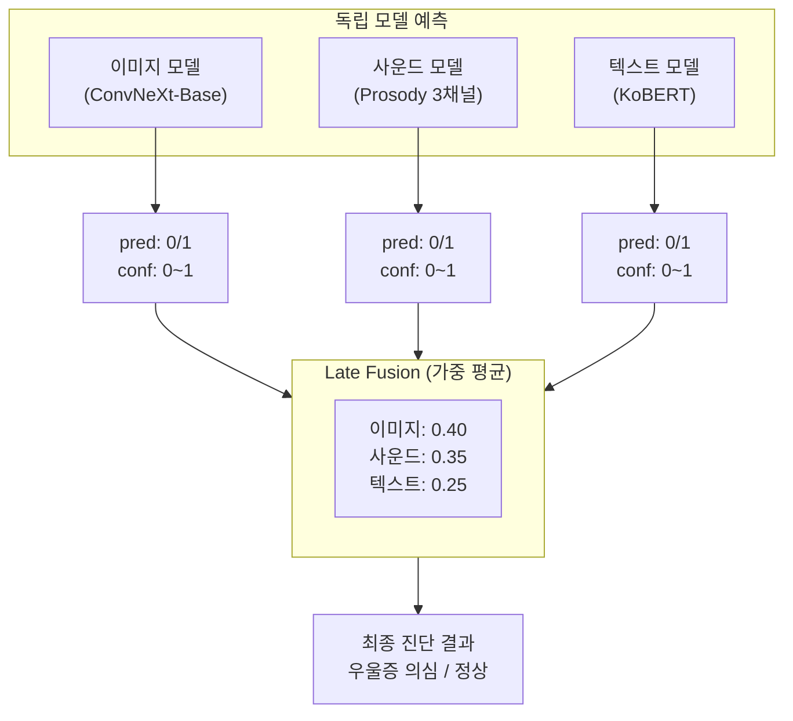
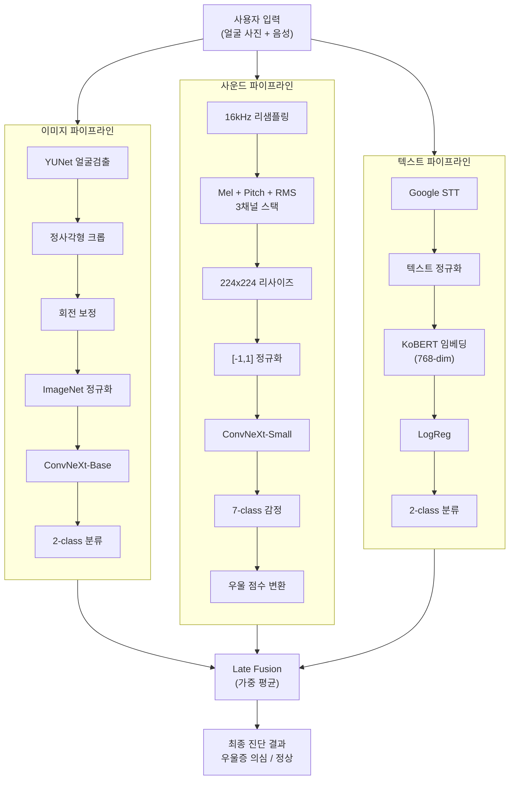
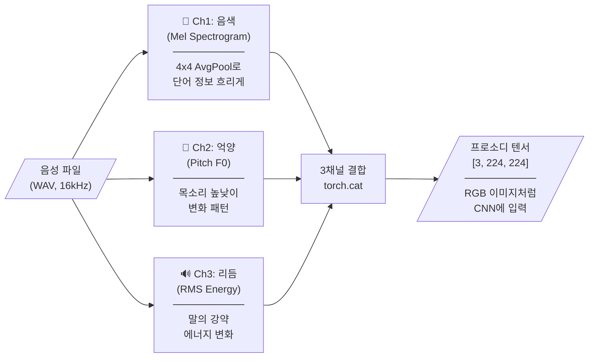

# 멀티모달 우울증 판별 서비스


> **얼굴 표정, 음성 운율, 발화 내용**을 종합 분석하여 우울증 위험도를 판별하는 멀티모달 딥러닝 시스템

---

## 프로젝트 소개

이 프로젝트는 단일 모달리티의 한계를 극복하기 위해 **3가지 독립적인 딥러닝 모델**을 결합한 멀티모달 우울증 판별 시스템입니다.

### 차별점

| 기존 방식 | 본 프로젝트 |
|----------|------------|
| 단일 모달리티(설문/음성)에 의존 | 이미지 + 사운드 + 텍스트 3가지 모달리티 통합 |
| "무슨 말을 했는가"에 집중 | **"어떻게 말했는가"(운율/프로소디)** 분석 |
| End-to-end 학습으로 디버깅 어려움 | 각 모델 독립 학습 후 Late Fusion |

---

## 핵심 기술 요약

### 왜 이 모델을 선택했는가?

| 모달리티 | 선택 모델 | 선택 이유 |
|---------|----------|----------|
| **이미지** | ConvNeXt-Base | ViT 대비 소규모 데이터 안정성, ResNet 대비 높은 성능 |
| **사운드** | 프로소디 3채널 + ConvNeXt-Small | Wav2Vec2는 내용 중심, 프로소디는 운율 특화 |
| **텍스트** | KoBERT + Logistic Regression | BERT Fine-tuning 대비 과적합 방지, 임베딩만으로 충분 |
| **통합** | Late Fusion (가중 평균) | Early Fusion 대비 디버깅 용이, 결측 처리 유연 |

### 어떻게 3개 모델을 통합했는가?



**가중치 설정 근거**:
- **이미지(0.40)**: 얼굴 표정은 우울증의 가장 직관적/신뢰도 높은 지표
- **사운드(0.35)**: 운율 변화(억양 저하, 말 속도 감소)는 우울증과 높은 상관관계
- **텍스트(0.25)**: STT 오류 가능성, 내용은 간접적 지표

---

## 기술 스택

### Core ML/DL

| 기술 | 버전 | 용도 |
|-----|------|-----|
| PyTorch | 2.x | 딥러닝 프레임워크 |
| torchvision | - | ConvNeXt 모델, 이미지 전처리 |
| torchaudio | 2.8+ | 오디오 처리, 멜 스펙트로그램 |
| sentence-transformers | 5.1+ | KoBERT 임베딩 |
| librosa | 0.11+ | 오디오 분석, pYIN 피치 검출 |
| OpenCV | 4.11+ | YUNet 얼굴 검출 |

### Backend & UI

| 기술 | 용도 |
|-----|-----|
| FastAPI | REST API 서버 |
| Streamlit | 데모 웹 UI |
| SpeechRecognition | Google STT API |

### 개발 도구

| 기술 | 용도 |
|-----|-----|
| uv | Python 패키지 관리 |
| TensorBoard | 학습 시각화 |
| Optuna | 하이퍼파라미터 튜닝 |

---

## 아키텍처



---

## 모델별 상세 설명

### 1. 이미지 모델: ConvNeXt-Base

#### 왜 ConvNeXt인가?

| 모델 | 장점 | 단점 | 선택 |
|------|------|------|------|
| ResNet50 | 널리 검증됨, Transfer Learning 용이 | 2015년 아키텍처, 성능 한계 | 초기 실험용 |
| ViT-B/16 | SOTA 성능, 전역 컨텍스트 학습 | 대규모 데이터 필요, 학습 불안정 | X |
| EfficientNet-B0 | 효율적 파라미터 사용 | 복합 스케일링 튜닝 복잡 | X |
| **ConvNeXt-Base** | CNN의 안정성 + Transformer 수준 성능 | 비교적 최신 (2022) | **O** |

**ConvNeXt 선택 이유**:
1. **CNN 기반 안정성**: ViT와 달리 소규모 데이터셋에서도 안정적으로 학습
2. **Transformer 수준 성능**: Swin Transformer와 동등한 성능을 CNN 구조로 달성
3. **Transfer Learning 친화적**: ImageNet 사전학습 가중치가 얼굴 특성 추출에 효과적

#### 핵심 구현

```python
# hwa_in/combind/image/image_model.py
class DepressionClassifier(nn.Module):
    def __init__(self, dropout_rate=0.5):
        super().__init__()
        # ImageNet 사전학습 가중치 로드
        weights = ConvNeXt_Base_Weights.IMAGENET1K_V1
        self.backbone = convnext_base(weights=weights)
        
        # 원래 분류기 제거 후 우울/비우울 이진 분류기로 교체
        in_features = self.backbone.classifier[-1].in_features
        self.backbone.classifier[-1] = nn.Identity()
        self.classifier = nn.Sequential(
            nn.Dropout(p=dropout_rate),
            nn.Linear(in_features, 2)  # 2-class: 우울/비우울
        )
```

#### 3-Phase Training 전략


**이 전략의 이점**:
- Classifier가 먼저 안정화된 후 Backbone을 미세 조정하여 과적합 방지
- 1 에포크 테스트로 데이터 품질 문제를 조기 발견

---

### 2. 사운드 모델: 프로소디(Prosody) 3채널

#### 왜 프로소디인가?

| 접근법 | 장점 | 단점 | 선택 |
|--------|------|------|------|
| Wav2Vec2 Fine-tuning | SOTA 음성 인식 | 내용(Content) 중심, 프로소디 약함 | X |
| MFCC + LSTM | 시계열 학습 | 음소 정보 과다, 언어 의존적 | X |
| OpenSMILE 특성 | 풍부한 음향 특성 | 수백 개 특성, 해석 어려움 | X |
| **Prosody 3채널 + CNN** | 운율 특화, ImageNet 전이학습 가능 | 커스텀 전처리 필요 | **O** |

**핵심 아이디어**: 우울증은 "무엇을 말했는가"보다 **"어떻게 말했는가"**(억양, 강세, 리듬)가 더 중요한 지표

#### 3채널 프로소디 텐서 구조

> 음성에서 **"무슨 말을 했는가"**(내용)가 아닌 **"어떻게 말했는가"**(운율)를 추출합니다.



| 채널 | 추출 정보 | 우울증 관련성 |
|:----:|----------|--------------|
| **Ch1: 음색** | 목소리의 음질/톤 | 우울 시 목소리가 탁해지고 단조로워짐 |
| **Ch2: 억양** | 말의 높낮이 변화 | 우울 시 억양 변화가 줄어듦 (평탄해짐) |
| **Ch3: 리듬** | 말의 강약/속도 | 우울 시 말이 느려지고 에너지가 낮아짐 |

#### 핵심 구현

```python
# hwa_in/combind/sound/sound_model.py
def wav_to_prosody_tensor(path: str) -> torch.Tensor:
    # 1) 멜 스펙트로그램 (저해상도 + 블러링으로 음소 희석)
    Smel = mel_spec(y_t)
    Smel_low = _avg_pool_2d(Smel, k_freq=4, k_time=4)  # 핵심: 4x4 풀링
    ch_mel = _resize_to(Smel_low, original_size)
    
    # 2) 피치(F0) -> 가우시안 띠 (억양 패턴)
    f0, _, _ = librosa.pyin(y, fmin=50, fmax=800)
    ch_pitch = _f0_to_band(f0, sigma=1.5)
    
    # 3) RMS 에너지 (강세/리듬)
    rms = librosa.feature.rms(y=y)
    ch_rms = normalize(rms)
    
    # 4) 3채널 스택 -> [3, 224, 224] 텐서
    x = torch.cat([ch_mel, ch_pitch, ch_rms], dim=0)
    return F.interpolate(x, size=(224, 224))
```

#### 우울 점수 계산 공식

7-class 감정 분류 결과를 우울 점수로 변환:

```python
# 긍정 감정
POS = (happiness + surprise) / 2

# 부정 감정 (슬픔에 가장 높은 가중치)
NEG_weighted = (0.4 * sadness + 0.3 * neutral + 0.1 * fear 
               + 0.1 * disgust + 0.1 * anger) / 5

# 최종 우울 점수 (0~1)
score = NEG_weighted / (NEG_weighted + POS + 1e-8)
```

**슬픔 가중치 0.4 설정 근거**: 우울증의 핵심 증상이 지속적 슬픔(Persistent Sadness)이므로 가장 높은 가중치 부여

---

### 3. 텍스트 모델: KoBERT + Logistic Regression

#### 왜 Fine-tuning 대신 Logistic Regression인가?

| 접근법 | 장점 | 단점 | 선택 |
|--------|------|------|------|
| KoBERT Fine-tuning | End-to-end 학습 | 소규모 데이터 과적합, GPU 메모리 과다 | X |
| KoGPT2 + Classification Head | 생성+분류 가능 | 불필요한 복잡도 | X |
| TF-IDF + Logistic Regression | 빠름, 해석 가능 | 문맥 정보 없음 | X |
| **KoBERT Embedding + Logistic Reg** | 문맥 임베딩 + 단순 분류기 | 2단계 파이프라인 | **O** |

**선택 이유**:
1. **풍부한 의미 정보**: KoBERT(768-dim)가 이미 충분한 문맥 정보 포함
2. **과적합 방지**: 단순한 Linear 레이어로 복잡도 최소화
3. **빠른 추론**: 임베딩만 추출하면 분류는 O(1) 연산

#### 핵심 구현

```python
# hwa_in/combind/text/text_model.py

# 임베더: 한국어 특화 Sentence-BERT
embedder = SentenceTransformer("jhgan/ko-sbert-multitask", device=device)

# 분류기: 단순 Logistic Regression
class LogisticRegression(nn.Module):
    def __init__(self, input_dim=768, num_classes=2):
        super().__init__()
        self.linear = nn.Linear(input_dim, num_classes)
    
    def forward(self, x):
        return self.linear(x)  # 768-dim -> 2-class
```

---

### 4. 멀티모달 통합: Late Fusion

#### 왜 Late Fusion인가?

| 통합 방식 | 장점 | 단점 | 선택 |
|----------|------|------|------|
| Early Fusion | End-to-end 학습 | 차원 폭발, 결측 처리 어려움 | X |
| Joint Training | 최적화된 통합 | 학습 불안정, 디버깅 어려움 | X |
| Late Fusion (평균) | 단순, 안정적 | 모달리티 중요도 미반영 | X |
| **Late Fusion (가중 평균)** | 모달리티별 가중치 조절 가능 | 가중치 튜닝 필요 | **O** |

**선택 이유**:
1. **모달리티 독립성**: 각 모델을 개별 학습 -> 디버깅/개선 용이
2. **결측 처리**: STT 실패 시 텍스트 결과만 제외하고 나머지 사용 가능
3. **확장성**: 새로운 모달리티 추가 시 기존 모델 수정 불필요

#### 핵심 구현

```python
# hwa_in/combind/AutoPredict.py
class AutoPredict:
    def combind_predict(self, image_file, sound_file):
        """3개 모달리티를 독립 예측 후 결합"""
        image_result = self.image_predict(image_file)   # 얼굴 표정
        sound_result = self.sound_predict(sound_file)   # 운율/프로소디
        text_result = self.text_predict(sound_file)     # 발화 내용 (STT)
        
        return {
            "image": image_result,  # {"pred": 0/1, "conf": float}
            "sound": sound_result,
            "text": text_result
        }

# 권장 최종 진단 로직 (가중 평균)
def get_weighted_prediction(results):
    weights = {'image': 0.4, 'sound': 0.35, 'text': 0.25}
    score = (weights['image'] * results['image']['conf'] +
             weights['sound'] * results['sound']['conf'] +
             weights['text'] * results['text']['conf'])
    return 1 if score > 0.5 else 0
```

---

## 빠른 시작

### 사전 요구사항

- Python 3.10 이상
- CUDA 지원 GPU (권장)
- ffmpeg (오디오 처리용)

### 설치

```bash
# 저장소 클론
git clone https://github.com/LonerStayle/aug-08month_project5.git
cd aug-08month_project5

# uv로 의존성 설치 (권장)
pip install uv
uv pip install -r pyproject.toml

# 또는 pip 사용
pip install -e .
```

### 환경 변수 설정 (선택사항)

```bash
# 모델 경로 커스터마이징 (기본값은 hwa_in/model/)
export HWA_IN_SOUND_MODEL_PATH=/path/to/sound_model.pth
export HWA_IN_TEXT_MODEL_PATH=/path/to/text_model.pt
```

### 실행

```bash
# Streamlit 데모 실행
streamlit run ai_streamlit.py

# 또는 FastAPI 서버 실행
uvicorn main:app --reload
```

---

## 프로젝트 구조

```
multimodal-depression-check-service/
├── hwa_in/                          # 메인 모듈
│   ├── combind/                     # 멀티모달 통합
│   │   ├── AutoPredict.py           # 3개 모델 통합 예측 클래스
│   │   ├── image/
│   │   │   ├── image_model.py       # ConvNeXt 이미지 모델
│   │   │   └── config.py            # 이미지 모델 설정
│   │   ├── sound/
│   │   │   └── sound_model.py       # 프로소디 사운드 모델
│   │   └── text/
│   │       └── text_model.py        # KoBERT 텍스트 모델
│   ├── data_model/                  # 공통 데이터 모델
│   │   ├── BuildModel.py            # 모델 빌더 유틸리티
│   │   ├── GlobalVariable.py        # 전역 상수 정의
│   │   └── ModelType.py             # 모델 타입 Enum
│   ├── pre_process/                 # 전처리 모듈
│   │   ├── img_preprocess.py        # 이미지 전처리
│   │   └── sound_preprocess.py      # 사운드 전처리
│   └── clean_training.ipynb         # 학습 파이프라인 노트북
├── docs/                            # 문서
│   ├── 핵심기술.md                   # 기술 선택 근거 상세 문서
│   └── API_FLOW.md                  # API 흐름 문서
├── main.py                          # FastAPI 엔트리포인트
├── ai_streamlit.py                  # Streamlit 데모 UI
├── pyproject.toml                   # 프로젝트 설정 및 의존성
└── README.md
```

---

## 학습 방법

### 이미지 모델 학습 (3-Phase Training)

```bash
# Jupyter Notebook 실행
jupyter notebook hwa_in/clean_training.ipynb
```

**주요 하이퍼파라미터**:

| 파라미터 | 값 | 설명 |
|---------|-----|------|
| epochs | 30 | 최대 에포크 수 |
| batch_size | 64 | 배치 크기 |
| lr | 1.5e-4 | 학습률 |
| dropout | 0.4 | Dropout 비율 |
| freeze_epochs | 5 | Backbone 고정 에포크 수 |
| patience | 8 | Early Stopping patience |

### 얼굴 검출 설정

YUNet + Haar Cascade 2단계 검출:

| 파라미터 | 값 | 설명 |
|---------|-----|------|
| face_margin | 0.22 | 얼굴 주변 여백 비율 |
| min_face_frac | 0.09 | 최소 얼굴 크기 (이미지 대비) |
| target_face_fill | 0.85 | 크롭 영역 내 얼굴 비율 목표 |
| fail_policy | "skip" | 검출 실패 시 샘플 제외 |

---

## 참고 문서

| 기술 | 공식 문서 |
|------|----------|
| ConvNeXt | [PyTorch Models](https://pytorch.org/vision/stable/models/convnext.html) |
| librosa (pYIN) | [librosa Docs](https://librosa.org/doc/main/generated/librosa.pyin.html) |
| Sentence-Transformers | [SBERT.net](https://www.sbert.net/) |
| KoBERT | [SKT GitHub](https://github.com/SKTBrain/KoBERT) |
| OpenCV YUNet | [OpenCV DNN Face](https://docs.opencv.org/4.x/d0/dd4/tutorial_dnn_face.html) |

---

## 라이선스

MIT License
