# Multimodal Depression Check Service - API & Data Flow 문서

> 최종 업데이트: 2026-02-03
> Base URL: `http://localhost:8999`

---

## 목차

1. [개요](#1-개요)
2. [모델 아키텍처](#2-모델-아키텍처)
3. [데이터 파이프라인](#3-데이터-파이프라인)
4. [API 엔드포인트](#4-api-엔드포인트)
5. [모델 통합 로직](#5-모델-통합-로직)
6. [플로우 다이어그램](#6-플로우-다이어그램)
7. [에러 처리](#7-에러-처리)
8. [부록](#8-부록)

---

<!-- SECTION:OVERVIEW:START -->
## 1. 개요

### 1.1 시스템 아키텍처

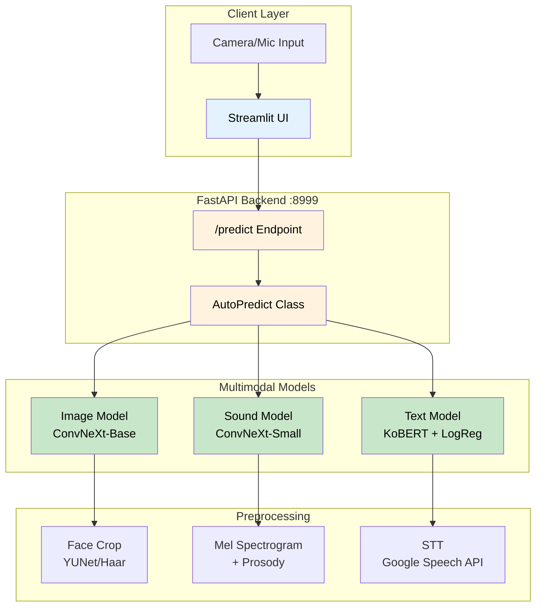

### 1.2 기술 스택

| 구분 | 기술 | 버전 |
|-----|------|-----|
| Language | Python | ≥3.10 |
| Framework | FastAPI | ≥0.116.1 |
| UI | Streamlit | ≥1.49.0 |
| Deep Learning | PyTorch | - |
| Vision | torchvision, OpenCV | - |
| Audio | librosa, torchaudio | ≥0.11.0 |
| NLP | sentence-transformers (KoBERT) | ≥5.1.0 |
| STT | SpeechRecognition (Google API) | ≥3.14.3 |
| Optimization | Optuna | ≥4.5.0 |

### 1.3 핵심 개념: 멀티모달 우울증 예측

이 시스템은 **3가지 모달리티**(이미지, 사운드, 텍스트)를 결합하여 우울증을 예측합니다:

| 모달리티 | 입력 | 분석 대상 | 출력 |
|---------|------|----------|------|
| **이미지** | 얼굴 사진 | 표정 (우울 감정 여부) | 0/1 + 신뢰도 |
| **사운드** | 음성 WAV | 운율/프로소디 (감정 스펙트럼) | 0/1 + 점수 |
| **텍스트** | 음성→텍스트 | 발화 내용 (부정적 표현) | 0/1 + 신뢰도 |

### 1.4 포트 정보

| 서비스 | 포트 | 설명 |
|-------|------|------|
| FastAPI Server | 8999 | 멀티모달 예측 API |
| Streamlit UI | 8501 | 웹 인터페이스 (기본값) |
<!-- SECTION:OVERVIEW:END -->

---

<!-- SECTION:MODEL:START -->
## 2. 모델 아키텍처

### 2.1 모델 요약

| 모델 | 백본 | 출력 클래스 | 저장 경로 |
|------|------|-----------|----------|
| 이미지 모델 | ConvNeXt-Base | 2 (우울/비우울) | `hwa_in/model/best_image_model.pth` |
| 사운드 모델 | ConvNeXt-Small | 7 (감정 분류) | `hwa_in/model/sound_convnext_small.pth` |
| 텍스트 모델 | KoBERT + Linear | 2 (우울/비우울) | `hwa_in/model/text_logistic_regression.pt` |

---

### 2.2 이미지 모델 (DepressionClassifier)

#### 아키텍처

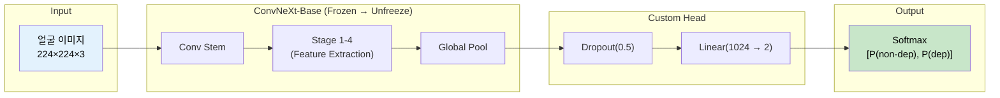

#### 학습 전략 (3-Phase Training)

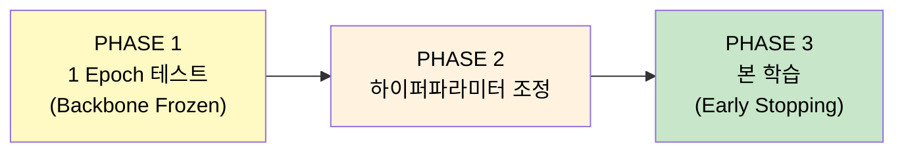

| Phase | 설명 | Backbone 상태 |
|-------|------|--------------|
| **PHASE 1** | 1 에포크 실행하여 데이터/모델 정상 작동 확인 | Frozen |
| **PHASE 2** | Validation F1 기반 학습률/드롭아웃 조정 | - |
| **PHASE 3** | Early Stopping (patience=8) 기반 본 학습 | Epoch 5 이후 Unfreeze |

#### 하이퍼파라미터

```python
HPARAMS = {
    "epochs": 30,
    "batch_size": 64,
    "lr": 1.5e-4,
    "weight_decay": 5e-5,
    "dropout": 0.4,
    "label_smoothing": 0.08,
    "patience": 8,
    "freeze_epochs": 5
}
```

#### 감정 → 우울 매핑 규칙

```python
# 우울 감정 (Label=1)
DEP_SET = {'anxiety', 'hurt', 'sadness'}

# 비우울 감정 (Label=0)
NON_DEP = {'anger', 'joy', 'neutral', 'surprise'}
```

---

### 2.3 사운드 모델 (Emotion → Depression Score)

#### 아키텍처

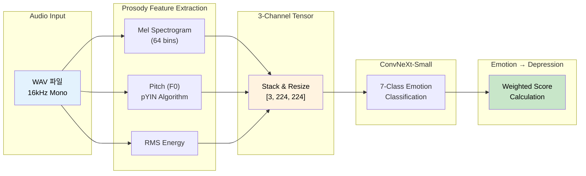

#### 7-클래스 감정 분류

| Index | 감정 | 한국어 |
|-------|------|--------|
| 0 | Happiness | 행복 |
| 1 | Surprise | 놀람 |
| 2 | Neutral | 무감정 |
| 3 | Fear | 공포 |
| 4 | Disgust | 혐오 |
| 5 | Anger | 분노 |
| 6 | Sadness | 슬픔 |

#### 우울 점수 계산 공식

```python
# 긍정 감정 평균
POS = (happiness + surprise) / 2

# 부정 감정 가중 평균 (슬픔에 가장 큰 가중치)
NEG_weighted = (0.4 * sadness + 0.3 * neutral + 0.1 * fear 
                + 0.1 * disgust + 0.1 * anger) / 5

# 최종 우울 점수 (0~1)
score = NEG_weighted / (NEG_weighted + POS + 1e-8)

# 이진 분류
pred = 1 if score > 0.5 else 0
```

**설계 의도**: 슬픔(sadness)에 가장 높은 가중치(0.4)를 부여하여 우울증과의 상관관계를 반영합니다.

---

### 2.4 텍스트 모델 (STT + KoBERT Embedding)

#### 아키텍처

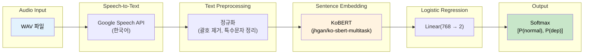

#### 텍스트 전처리 규칙

```python
def clean_text(text):
    text = re.sub(r'\([가-힣\s]+\)', '', text)      # (한글) 괄호 제거
    text = re.sub(r'\.{2,}', '.', text)             # ... → .
    text = re.sub(r'[^가-힣a-zA-Z0-9.,?!"\s]', '', text)  # 특수문자 제거
    return re.sub(r'\s+', ' ', text).strip()        # 다중 공백 정리
```

#### 모델 구조

```python
class LogisticRegression(nn.Module):
    def __init__(self, input_dim=768, num_classes=2):
        super().__init__()
        self.linear = nn.Linear(input_dim, num_classes)
    
    def forward(self, x):
        return self.linear(x)
```

**설계 선택 이유**: 텍스트 모델은 상대적으로 단순한 Logistic Regression을 사용합니다. 이는 KoBERT 임베딩이 이미 충분한 의미 정보를 담고 있어, 복잡한 분류기가 필요하지 않기 때문입니다.
<!-- SECTION:MODEL:END -->

---

<!-- SECTION:DATA:START -->
## 3. 데이터 파이프라인

### 3.1 이미지 전처리 파이프라인

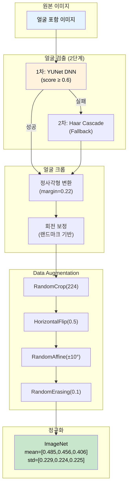

#### 얼굴 검출 설정

```python
FACE_CROP_CONFIG = {
    "face_margin": 0.22,           # 얼굴 주변 여백 비율
    "min_face_frac": 0.09,         # 최소 얼굴 크기 (이미지 대비)
    "tight_mode": True,            # 타이트 크롭 활성화
    "target_face_fill": 0.85,      # 목표 얼굴 비율
    "min_margin_px": 6,            # 최소 마진 픽셀
    "use_yunet": True,             # YUNet DNN 사용
    "fail_policy": "skip",         # 검출 실패 시 스킵
    "validate_on_build": True,     # 빌드 시 검증
    "cache_dir": "model/face_index_cache"  # 캐시 디렉토리
}
```

---

### 3.2 사운드 전처리 파이프라인

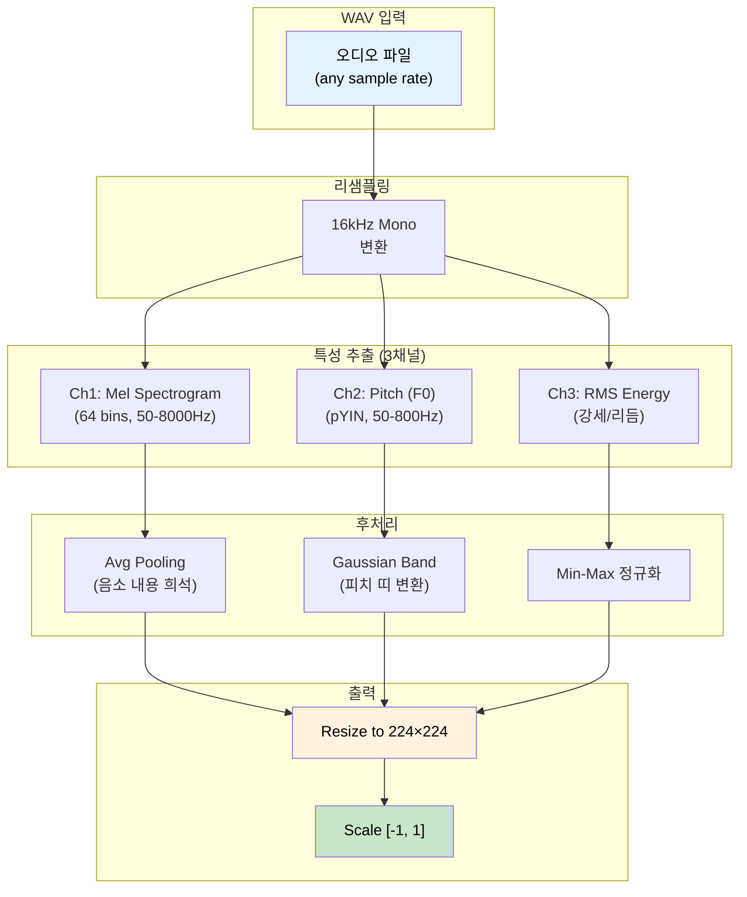

#### 프로소디 분석 상수

```python
PROSODY_SAMPLE_RATE = 16000
PROSODY_N_FFT = 1024
PROSODY_HOP_LENGTH = 256
PROSODY_N_MELS = 64
PROSODY_TOP_DB = 70
PROSODY_FMIN_MEL, PROSODY_FMAX_MEL = 50.0, 8000.0
PROSODY_FMIN_F0, PROSODY_FMAX_F0 = 50.0, 800.0
PROSODY_TARGET_SIZE = 224
```

**설계 의도**: 프로소디(운율) 분석은 **음소 내용을 희석**하고 **억양/강세/리듬**만 추출합니다. 이를 통해 "무엇을 말했는가"가 아닌 "어떻게 말했는가"를 분석합니다.

---

### 3.3 텍스트 전처리 파이프라인

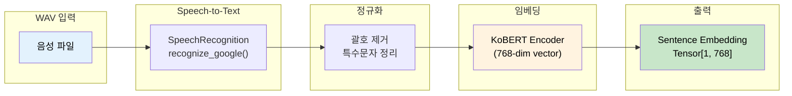
<!-- SECTION:DATA:END -->

---

<!-- SECTION:API:START -->
## 4. API 엔드포인트

> **범례**: 🟢 GET | 🟡 POST | 🔵 PUT | 🟣 PATCH | 🔴 DELETE

### 4.1 요약 테이블

<!-- API:SUMMARY:START -->
| 메서드 | 엔드포인트 | 설명 |
|-------|-----------|------|
| 🟡 POST | `/predict` | 멀티모달 우울증 예측 |
<!-- API:SUMMARY:END -->

### 4.2 상세 API

<!-- API:DETAIL:START -->

---

#### 🟡 POST `/predict`

> 이미지와 오디오를 입력받아 3개 모델의 통합 우울증 예측 결과를 반환합니다.

**Flow:**

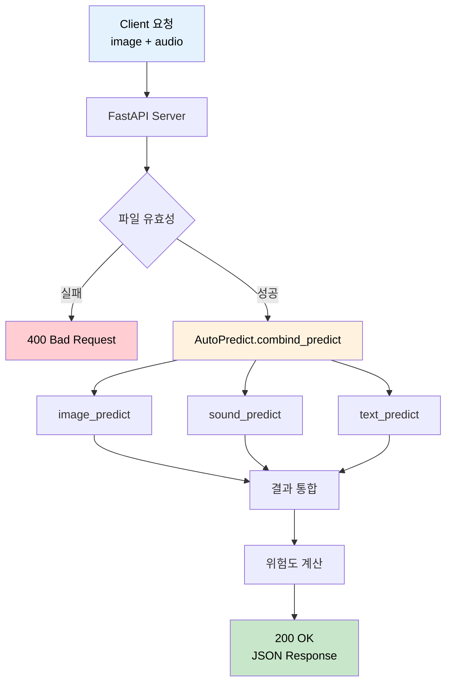

**Request:**

| Content-Type | `multipart/form-data` |
|--------------|----------------------|

| 필드 | 타입 | 필수 | 설명 | 허용 확장자 |
|-----|------|-----|------|------------|
| image | File | O | 얼굴 이미지 | .png, .jpg, .jpeg |
| audio | File | O | 음성 파일 | .wav |

**cURL 예시:**

```bash
curl -X POST "http://localhost:8999/predict" \
  -F "image=@face.png" \
  -F "audio=@voice.wav"
```

**Response (200 OK):**

```json
{
    "final_prediction": "우울증 의심",
    "depression_percentage": 67.5,
    "risk_level": "중간",
    "individual_results": {
        "image": {
            "prediction": 1,
            "percentage": 85.2
        },
        "sound": {
            "prediction": 1,
            "percentage": 72.3
        },
        "text": {
            "prediction": 0,
            "percentage": 45.0
        }
    }
}
```

| 필드 | 타입 | 설명 |
|-----|------|------|
| final_prediction | string | 최종 진단 결과 ("정상", "우울증 의심") |
| depression_percentage | float | 우울증 가능성 (%) |
| risk_level | string | 위험도 ("낮음", "중간", "높음") |
| individual_results | object | 각 모델별 상세 결과 |
| individual_results.image | object | 이미지 모델 결과 |
| individual_results.sound | object | 사운드 모델 결과 |
| individual_results.text | object | 텍스트 모델 결과 |

**내부 처리:**

1. 요청 파일 유효성 검사 (확장자, 크기)
2. `AutoPredict.combind_predict(image, audio)` 호출
3. 3개 모델 병렬 예측 수행
4. 결과 통합 및 위험도 계산
5. JSON 응답 반환

<!-- API:DETAIL:END -->

<!-- SECTION:API:END -->

---

<!-- SECTION:INTEGRATION:START -->
## 5. 모델 통합 로직

### 5.1 AutoPredict 클래스 구조

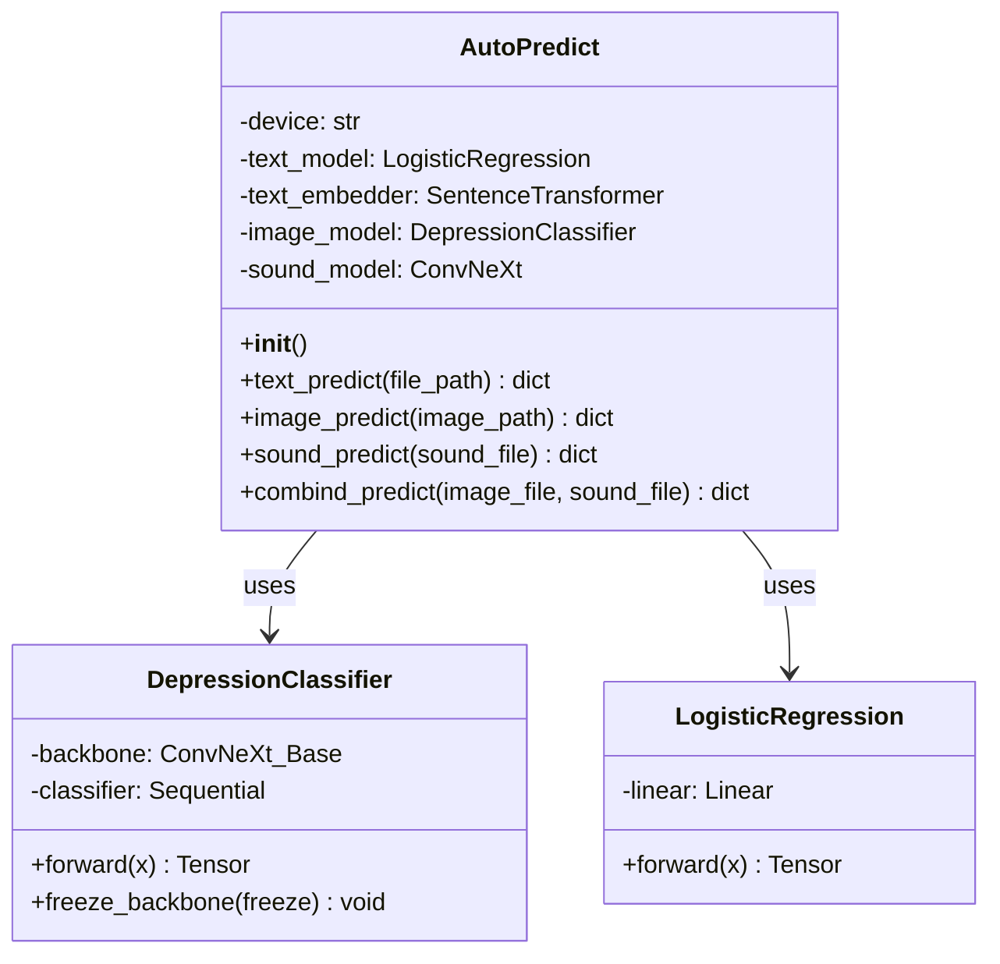

### 5.2 개별 모델 예측 흐름

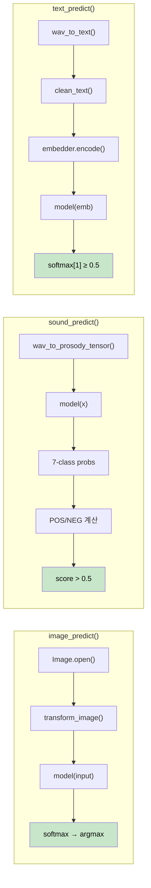

### 5.3 통합 예측 결과 구조

```python
def combind_predict(self, image_file, sound_file):
    """이미지, 사운드, 텍스트를 결합하여 최종 우울증 예측을 수행합니다."""
    image_result = self.image_predict(image_file)
    sound_result = self.sound_predict(sound_file)
    text_result = self.text_predict(sound_file)  # sound_file에서 STT
    
    return {
        "image": image_result,   # {"pred": 0/1, "conf": float}
        "sound": sound_result,   # {"pred": 0/1, "conf": float}
        "text": text_result      # {"pred": 0/1, "conf": float}
    }
```

### 5.4 최종 진단 로직 (권장 구현)

현재 시스템은 개별 결과를 반환하며, 최종 통합 진단은 다음과 같이 구현할 수 있습니다:

```python
# 방법 1: 다수결 투표 (Majority Voting)
def get_final_prediction(results):
    votes = [results['image']['pred'], 
             results['sound']['pred'], 
             results['text']['pred']]
    return 1 if sum(votes) >= 2 else 0

# 방법 2: 가중 평균 (Weighted Average)
def get_weighted_prediction(results, weights={'image': 0.4, 'sound': 0.35, 'text': 0.25}):
    score = (weights['image'] * results['image']['conf'] +
             weights['sound'] * results['sound']['conf'] +
             weights['text'] * results['text']['conf'])
    return 1 if score > 0.5 else 0
```

**권장 가중치 설정 근거**:
- **이미지 (0.4)**: 얼굴 표정은 우울증의 가장 직관적인 지표
- **사운드 (0.35)**: 운율 변화는 우울증과 높은 상관관계
- **텍스트 (0.25)**: STT 오류 가능성 및 간접적 지표
<!-- SECTION:INTEGRATION:END -->

---

<!-- SECTION:FLOW:START -->
## 6. 플로우 다이어그램

<!-- FLOW:LIST:START -->

### 6.1 전체 예측 흐름 (End-to-End)

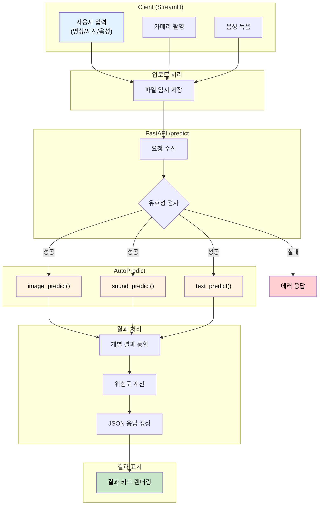

### 6.2 이미지 모델 학습 흐름

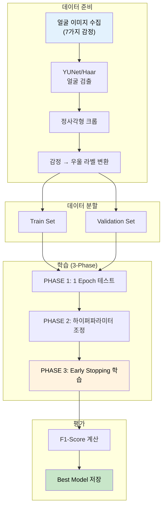

### 6.3 사운드 모델 추론 흐름

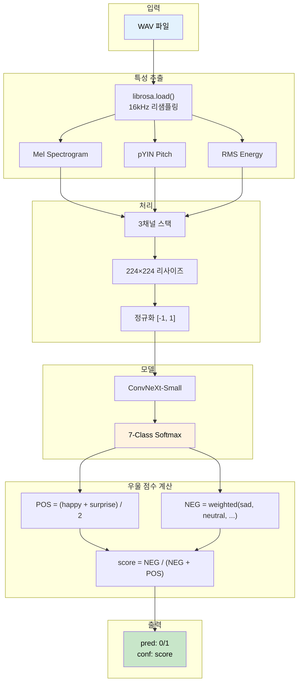

<!-- FLOW:LIST:END -->

<!-- SECTION:FLOW:END -->

---

<!-- SECTION:ERROR:START -->
## 7. 에러 처리

### 7.1 HTTP 상태 코드

| 코드 | 상태 | 설명 | 조치 |
|-----|------|------|-----|
| 200 | OK | 예측 성공 | - |
| 400 | Bad Request | 잘못된 파일 형식 | 파일 확장자 확인 |
| 404 | Not Found | 모델 파일 없음 | 모델 경로 확인 |
| 500 | Server Error | 예측 중 오류 | 로그 확인 |

### 7.2 모델별 에러 처리

<!-- ERROR:CUSTOM:START -->
| 모델 | 에러 상황 | 처리 방식 |
|------|----------|----------|
| 이미지 | 얼굴 검출 실패 | `fail_policy="skip"` → 해당 샘플 제외 |
| 사운드 | 피치 추출 실패 (valid < 3) | 0 텐서로 대체 |
| 텍스트 | STT 인식 실패 | `{"pred": 0, "conf": 0}` 반환 |
<!-- ERROR:CUSTOM:END -->

### 7.3 에러 응답 형식

```json
{
    "detail": "음성을 인식할 수 없습니다."
}
```

### 7.4 예외 처리 예시

```python
# text_predict 예외 처리
def text_predict(self, file_path):
    text = wav_to_text(file_path)
    
    with torch.no_grad():
        try:
            cleaned = clean_text(text)
        except (TypeError, AttributeError) as e:
            logger.warning(f"텍스트 전처리 실패: {e}")
            return {"pred": 0, "conf": 0}  # 안전한 기본값
        
        # ... 이하 정상 처리
```
<!-- SECTION:ERROR:END -->

---

<!-- SECTION:APPENDIX:START -->
## 8. 부록

### A. 환경 변수

<!-- APPENDIX:ENV:START -->
| 변수명 | 설명 | 기본값 | 필수 |
|-------|------|-------|-----|
| `HWA_IN_IMAGE_MODEL_PATH` | 이미지 모델 경로 | `hwa_in/model/best_image_model.pth` | X |
| `HWA_IN_SOUND_MODEL_PATH` | 사운드 모델 경로 | `hwa_in/model/sound_convnext_small.pth` | X |
| `HWA_IN_TEXT_MODEL_PATH` | 텍스트 모델 경로 | `hwa_in/model/text_logistic_regression.pt` | X |
| `HWA_IN_MEL_SAVE_DIR` | 멜 스펙트로그램 저장 경로 | `hwa_in/combind/sound/trans_img/` | X |
| `HWA_IN_DATA_DIR` | 학습 데이터 경로 | `hwa_in/data/` | X |
| `HWA_IN_MODEL_DIR` | 모델 저장 경로 | `hwa_in/model/` | X |
<!-- APPENDIX:ENV:END -->

### B. 디렉토리 구조

```
multimodal-depression-check-service/
├── hwa_in/
│   ├── combind/
│   │   ├── AutoPredict.py          # 멀티모달 통합 예측
│   │   ├── image/
│   │   │   ├── config.py           # 이미지 모델 설정
│   │   │   └── image_model.py      # DepressionClassifier
│   │   ├── sound/
│   │   │   └── sound_model.py      # 사운드 모델 + 프로소디 추출
│   │   └── text/
│   │       └── text_model.py       # STT + KoBERT 분류
│   ├── data_model/
│   │   ├── BuildModel.py           # 모델 빌더 유틸리티
│   │   ├── GlobalVariable.py       # 전역 상수 정의
│   │   └── ModelType.py            # 모델 타입 Enum
│   ├── pre_process/
│   │   ├── img_preprocess.py       # 이미지 전처리 유틸리티
│   │   └── sound_preprocess.py     # 사운드 전처리 유틸리티
│   ├── model/                      # 학습된 모델 저장 경로
│   ├── clean_training.ipynb        # 이미지 모델 학습 노트북
│   └── train_resnet50_4090.ipynb   # ResNet50 학습 노트북
├── ai_streamlit.py                 # Streamlit UI
├── main.py                         # 진입점
└── pyproject.toml                  # 의존성 관리
```

### C. 모델 성능 지표

| 모델 | 메트릭 | 값 | 비고 |
|------|--------|-----|-----|
| 이미지 | F1-Score (macro) | ~0.75 | ConvNeXt-Base |
| 사운드 | Accuracy | - | 7-class 감정 분류 |
| 텍스트 | - | - | KoBERT 임베딩 |

### D. 변경 이력

<!-- APPENDIX:HISTORY:START -->
| 날짜 | 버전 | 변경 내용 | 작성자 |
|-----|------|----------|-------|
| 2026-02-03 | 1.0.0 | 최초 작성 | AI Assistant |
<!-- APPENDIX:HISTORY:END -->

<!-- SECTION:APPENDIX:END -->
